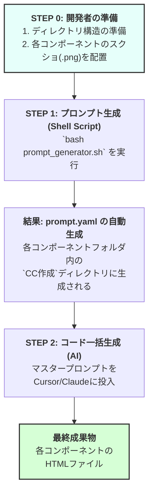

```markdown
# Webサイトコンポーネント自動生成ワークフロー

このリポジトリは、Webサイトの特定セクションのスクリーンショットから、HTML/CSSコードを自動生成するための一連のワークフローを管理します。

このワークフローは、大きく分けて2つのフェーズで構成されています。
1.  **プロンプト生成フェーズ**: 指定されたディレクトリ構造とスクリーンショット（.png）を元に、AIへの指示書（`prompt.yaml`）を自動で生成します。
2.  **コード生成フェーズ**: 生成された`prompt.yaml`を元に、AI（Cursor/Claude）が各コンポーネントのHTML/CSSコードを一括で生成します。

## ワークフローの全体像



## 【最重要】実行に必要なデータと事前準備

このワークフローを実行するには、**厳格なルールに基づいたディレクトリ構造と、その中に配置されたスクリーンショット画像（.png）が必須**です。AIはこれらの「資材」を元に全ての作業を行うため、準備が不十分だとワークフローは機能しません。

### 1. 必須のディレクトリ構造

以下の構造でディレクトリとファイルを準備してください。

```plaintext
/Users/hattaryoga/Downloads/サイトテンプレ/datsumo-osusume-guide.comのコピー/
└── サイト分割/  <-- このパスをスクリプト内の`BASE_DIR`に設定
    ├── 2_mv copy/
    │   ├── CC作成/         <-- (空でOK. prompt.yamlとHTMLがここに生成される)
    │   └── 参考/
    │       └── sp_mv_screenshot.png  <-- MVセクションのSP版スクショ
    │
    ├── 3_ランキング_結果/
    │   ├── CC作成/
    │   └── 参考/
    │       └── sp_ranking_screenshot.png
    │
    ├── 4_Tips/
    │   ├── CC作成/
    │   └── 参考/
    │       ├── sp_tip_1.png          <-- 複数画像も可 (タブUIになる)
    │       └── sp_tip_2.png
    │
    ├── 5_比較表/
    │   ├── CC作成/
    │   └── 参考/
    │       ├── sp_hikaku_1.png         <-- 複数画像も可 (カルーセルUIになる)
    │       └── sp_hikaku_2.png
    │
    ├── 6_詳細コンテンツ/
    │   ├── CC作成/
    │   └── 参考/
    │       ├── sp_content_part1.png  <-- 複数画像も可 (縦に結合される)
    │       └── sp_content_part2.png
    │
    └── (以下、他のコンポーネントも同様)
```

**【準備のポイント】**

*   **`BASE_DIR`**: シェルスクリプト内の変数 `BASE_DIR` に、親ディレクトリ（上記例では `サイト分割/`）の絶対パスを正しく設定してください。
*   **コンポーネントフォルダ名**: `2_mv copy`, `3_ランキング_結果` のような命名規則 (`[番号]_[名前]`) に従ってください。
*   **`CC作成` と `参考`**: 各コンポーネントフォルダ内に、必ずこの2つのサブディレクトリを作成してください。`CC作成`は成果物の出力先、`参考`は入力画像の格納場所です。
*   **スクリーンショット (`.png`)**:
    *   **唯一の入力データです。** この画像の見た目をピクセルパーフェクトで再現することがAIのタスクです。
    *   `参考/` ディレクトリ内に、再現したいコンポーネントの**スマートフォン表示（横幅375px）**のスクリーンショットを配置してください。
    *   複数枚の画像を配置する場合、**ファイルの作成日時順**に読み込まれ、`prompt.yaml`にリストされます。

### 2. 特殊なUIを実装するためのフォルダ名

特定のフォルダ名は、生成される`prompt.yaml`に特別なUI実装指示を追加するトリガーとなります。

*   `4_Tips`: 複数の画像を**タブ切り替えUI**として実装するよう指示します。
*   `5_比較表`: 複数の画像を**横スライド（カルーセル）UI**として実装するよう指示します。
*   `6_詳細コンテンツ` または `7_コラム`: 複数の画像を**縦に連続した1つのセクション**として実装するよう指示します。

---

## 実行手順

### Step 1: `prompt.yaml` の自動生成

1.  上記の「事前準備」に従って、ディレクトリとスクリーンショットを配置します。
2.  `prompt_generator.sh`（提示されたシェルスクリプト）を開き、`BASE_DIR`変数が正しいパスを指していることを確認します。
3.  ターミナルでスクリプトを実行します。
    ```bash
    bash /path/to/your/prompt_generator.sh
    ```
4.  実行後、各コンポーネントの `CC作成/` ディレクトリ内に `prompt.yaml` ファイルが生成されていることを確認します。

### Step 2: AIによるコードの一括生成

1.  `prompt.yaml` の生成が完了したら、2つ目の「マスタープロンプト」（`あなたは、Cursorと連携して動作する優秀なプロジェクト自動化アシスタントです。`から始まるプロンプト）をコピーします。
2.  CursorやClaudeなどのAI開発環境にペーストし、実行します。
3.  AIは `@サイト分割/2_mv copy/CC作成/prompt.yaml` から順番に処理を開始し、各コンポーネントのHTMLコードを生成していきます。
4.  全ての処理が完了すると、AIは「全てのコンポーネントの生成が完了しました。」と報告します。成果物は各`CC作成`ディレクトリ内に指定されたファイル名（例: `2_mv_copy.html`）で保存されている想定です。（※AIのファイル出力機能に依存）

```